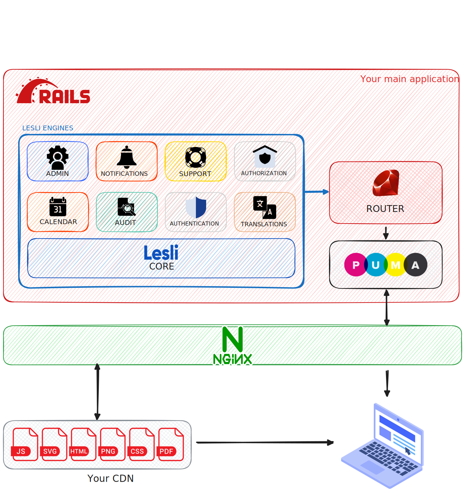

# Lesli

**Lesli** is an open-source Ruby on Rails framework for building scalable, secure, and customizable SaaS applications.

Built on proven technologies such as **Ruby on Rails**, **PostgreSQL**, **Hotwire**, **Bulma**, **Sass**, and **Alpine.js**, Lesli gives you a strong foundation for developing serious software products without starting from scratch.

More than a starter kit or boilerplate, Lesli is a modular framework that helps you build applications through reusable engines, built-in components, generators, and shared conventions. You can use it to extend existing functionality, integrate ready-made modules, or develop fully customized solutions on top of a stable core.

---

## Why Lesli?

Lesli is fully open source and designed to save development teams months of work. Its modular architecture allows you to start with a solid foundation and expand your application by adding production-ready modules as your product grows.

Instead of rebuilding common SaaS capabilities from scratch, you can focus on delivering the features that make your product different.

Lesli is published under the **GNU General Public License v3 (GPLv3)**. You are free to use, modify, and redistribute it under the terms of that license.

---

## How It Works

Lesli is built around modularity and extensibility.

Need task management? Install the corresponding module. Want a calendar? Add the calendar module. Need custom business logic? Extend Lesli’s controllers, models, and services to adapt the framework to your application.

There are several ways to work with Lesli:

* Install official modules through gems
* Extend existing functionality through inheritance
* Integrate specific features through services and shared components
* Use Lesli as an API-first backend for web or mobile applications

---

## Why Ruby on Rails?

Lesli is built on Ruby on Rails to take advantage of one of the most mature and productive web application ecosystems available.

Rails provides strong conventions, a powerful ORM, routing, background jobs, testing tools, and a large open-source community. By building on top of Rails, Lesli inherits these strengths while adding a modular architecture and a growing ecosystem of SaaS-oriented capabilities.

This allows development teams to move faster, keep their codebases organized, and scale their applications with confidence.
