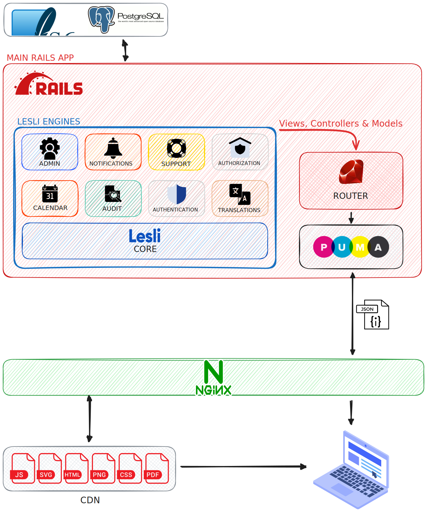

# Lesli

**Lesli** is a **SaaS Development Framework** designed to help you build highly scalable, secure, and customizable software products with ease.

It’s built on top of industry-proven technologies like **Ruby on Rails**, **PostgreSQL**, **Hotwire**, **Bulma**, **SASS**, **AlpineJS** and many other fantastic open-source libraries, gems, and tools.

Lesli provides a robust set of built-in features and a standard process for extending its capabilities through modules, making it easy to create your own custom components when needed.

> Lesli goes beyond being just a starter kit or boilerplate. It’s a Ruby on Rails-based core gem that enables you to build modular applications (a.k.a. engines) by leveraging its built-in features, generators, components, and industry best practices. With Lesli, you can easily extend existing functionality or develop fully customized solutions tailored to your specific needs.

 

## Why Lesli?

Lesli is **fully open source** and comes packed with tools and features that can save you months of development time. Thanks to its modular architecture, you can seamlessly extend Lesli’s functionality by adding pre-built modules — allowing you to get your SaaS product up and running in minutes.

Lesli is published under the **GNU General Public License version 3 (GPLv3)**. This means you’re free to use, copy, redistribute, and/or modify Lesli, as long as you comply with the terms of the GPL.

 

## How Does It Work?

 

## Ruby on Rails

**Ruby on Rails** (commonly referred to as **Rails**) is a popular open-source web application framework written in the Ruby programming language. Rails follows the **Model-View-Controller (MVC)** architectural pattern, providing developers with a structured, efficient approach to building web applications.

By using Rails as its foundation, Lesli benefits from Rails’ mature ecosystem, conventions, and built-in features. Rails simplifies common tasks such as routing, database management, and user authentication, allowing developers to focus on building the core functionalities of their SaaS applications more efficiently.
    

 

## SaaS Framework

In the context of SaaS development, Lesli leverages Ruby on Rails to deliver **scalable** and **customizable** software solutions accessible through the web.

**SaaS (Software as a Service)** is a delivery model where applications are centrally hosted and offered to customers as a service. This model eliminates the need for users to install or maintain software locally — everything runs in the cloud and is accessed through a web browser.

Lesli’s architecture and tools are purpose-built to support this model, enabling developers to build robust SaaS applications faster and more efficiently.
