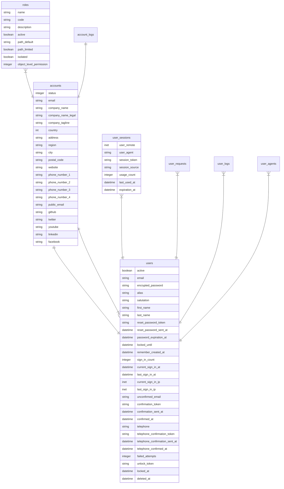

<p align="center">
    
</p>

<h3 align="center">Lesli core database</h3>

### 00.10. Core
```plaintext
00.01. accounts
00.02. roles
00.03. users
00.06. system_controllers
00.07. system_controller_actions

00.10. account_settings
00.11. account_locations
00.12. account_activities
00.13. account_integrations
00.14. account_files
00.15. account_currencies
00.16. account_currency_exchange_rates
00.17. account_cronos
00.18. account_crono_logs
00.19. account_crono_suscriptions
00.20. account_issues

00.03. user (reference only)
00.30. user_details
00.31. user_settings
00.32. user_sessions
00.33. user_requests
00.34. user_activities
00.35. user_roles
00.36. user_logs
00.37. user_access_codes
00.38. user_shortcuts
00.39. user_auth_provider
00.40. user_agents

00.50. descriptors
00.51. descriptor_privileges
00.52. descriptor_activities

00.02. roles (reference only)
00.55. role_descriptor
00.56. role_activities
00.57. role_privileges

00.90. issues
```


<fieldset>


</fieldset>
