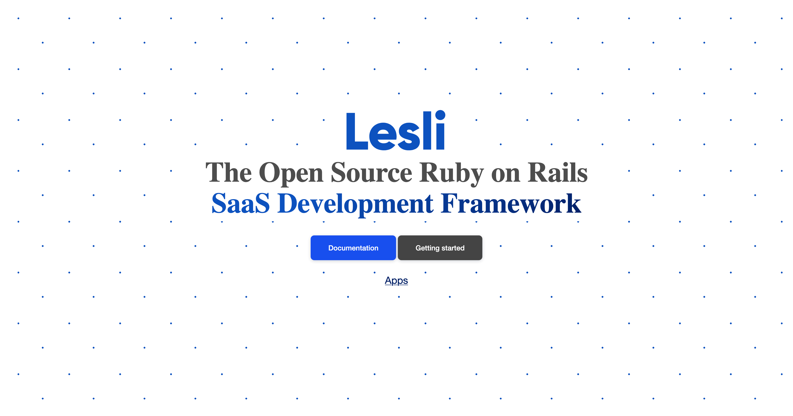

# Installation

Lesli is a Ruby on Rails gem designed to integrate seamlessly into your application. It keeps its code, database, and assets fully isolated, ensuring it won’t interfere with your main app. This isolation allows you to extend functionality without adding complexity or risking conflicts within your core codebase.


> **Before You Start:** Make sure you have **Ruby 3.2.x**, **Rails 8.0.x** and NodeJS 20.x (to work with LesliAssets) installed on your system.


## Create a New Rails Application

To get started, generate a fresh Ruby on Rails app. This will serve as the base for integrating Lesli.

```bash
rails new LesliApp
```


### Install the Lesli Core

```bash
bundle add lesli
```

> Or clone the repository for [development](https://www.lesli.dev/engines/lesli/getting-started/development/)


Check that Lesli is correctly installed and accessible by running:

```bash
rake lesli:status
```

>This will output the current status of the Lesli framework and confirm that it's properly wired into your application.


### Set Up Lesli

After installing the gem, run the Lesli installation generator to configure the required files and routes:

```bash
rails generate lesli:install
```

This command will:

- Generate a new initializer file at config/initializers/lesli.rb where you can customize core Lesli settings and behaviors.
- Mount all Lesli engine routes by injecting the following into your config/routes.rb file:

```ruby
Rails.application.routes.draw do
    Lesli::Routing.mount
end
```

Also is going to create a lesli.rb initializer file to customize the Lesli options


Lesli provides a convenient Rake task to set up a fully functional database for development and demo purposes.

Run the following command:

```bash
rake lesli:db:dev
```

This task will:

- Run all database migrations 
- Build privileges (if LesliSecurity is installed) 
- Import translation files (if LesliBabel is installed) 
- Seed demo users and sample data for every installed engine 
- Output a summary with the current application status 
- You can restart your database to start with a new fresh database 

<br>

To reset your environment and start from a clean state, run:

```bash
rake lesli:db:reset 
```
>This command will drop, create, migrate, and re-seed the database using the same logic as lesli:db:dev, Useful when testing or debugging your development setup.


Start the default Rails development server:

```shell
rails s 
rails s --binding=0.0.0.0
rails s --environment=test
rails s --environment=development
RAILS_SERVE_STATIC_FILES=true rails s --environment=production 
```

Using your favorite web browser, navigate to: <a href="http://127.0.0.1:3000/login" target="_blank">http://127.0.0.1:3000/login</a>

<lesli-browser host="http://localhost:3000/" url="">
    
</lesli-browser>

You should now see the Lesli welcome page 🎉

---

### Recommendations

To improve your local development experience with Lesli, consider the following:

- **Use `letter_opener` for Local Email Preview**

<br>

Install the `letter_opener` gem in your `Gemfile` under the development group:

```ruby
group :development do
    gem 'letter_opener'
end
```

Then configure your config/environments/development.rb:

```ruby
config.action_mailer.delivery_method = :letter_opener
config.action_mailer.perform_deliveries = true
config.action_mailer.default_url_options = { host: 'localhost', port: 3000 }
```

This allows you to preview emails in your browser instead of sending them during development.
