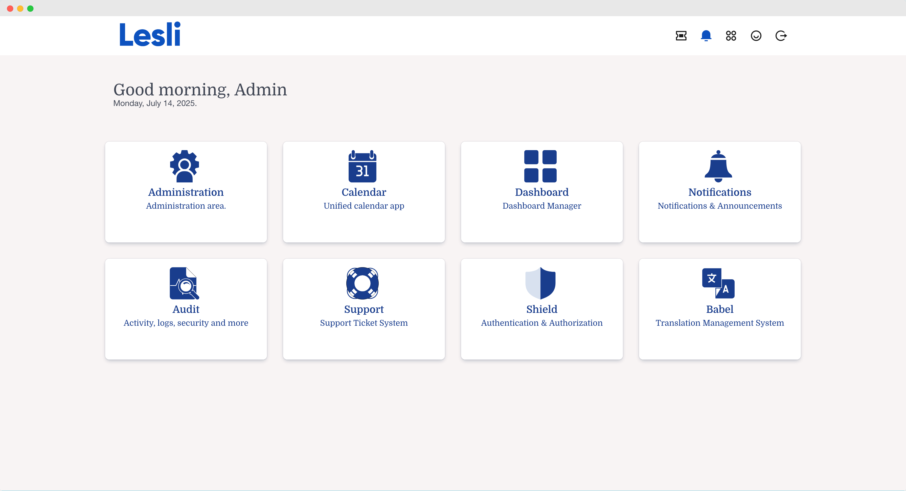

    
    <h1 align="center">Ruby on Rails SaaS Development Framework.</h1>

    
    
    

 

    

### Introduction 

Lesli is a SaaS development framework designed to build highly scalable, secure and customizable software products.

Built-on top of Ruby on Rails, Postgres, Vuejs, Bulma, SASS and many more awesome open-source libraries, packages, gems and tools.

Lesli is completely open source and comes with features and tools that can save you years of development effort, additionally, our pre-built modules can seamlessly extend Lesli's functionality, allowing you to build your own SaaS in a matter of minutes.

 

    Lesli is currently in alpha, but we're excited about the promising improvements coming soon!

 

 

Lesli is officially released and will be supported as of version 5.1

> Lesli goes beyond being just a starter-kit, template, admin panel or dashboard. Lesli is a Ruby on Rails gem that you can use to build modules (a.k.a. engines) and standard Rails applications leveraging its robust set of built-in features, generators, components, and industry standards. With Lesli, you have the flexibility to extend existing functionalities or develop fully customized software tailored to your specific needs.

