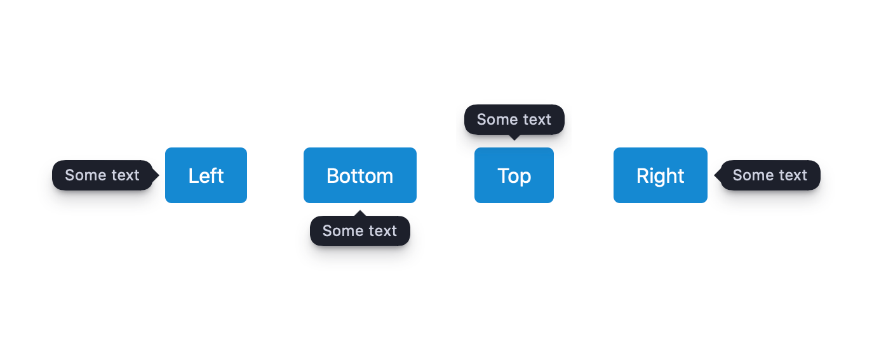

# codex.tooltips

Lightweight JavaScript module for adding tooltips with custom content
to any HTML element



## Installation

First, install it via package manager:

```shell
yarn add codex-tooltip
```

```shell
npm install codex-tooltip
```

Then, include tooltips to your script, create an instance and call hiding/showig methods:

```js
import Tooltip from 'codex.tooltip';

const tooltip = new Tooltip();

tooltip.show(targetElement, 'Tooltip text');

```

## Usage

There are two main methods: `show()` and `hide()`  

### Show

Method shows tooltip with custom content on passed element
 
```js
tooltip.show(element, content, options);
``` 

| parameter | type | description |
| -- | -- | -- |
| `element` | _HTMLElement_ | Tooltip will be showed near this element |
| `content` | _String_ or _Node_ | Content that will be appended to the Tooltip |
| `options` | _Object_ | Some displaying options, see below |

Available showing options 

| name | type | action |
| -- | -- | -- |
| placement | `top`, `bottom`, `left`, `right` | Where to place the tooltip. Default value is `bottom' | 
| marginTop | _Number_ | Offset above the tooltip with `top` placement | 
| marginBottom | _Number_ | Offset below the tooltip with `bottom` placement | 
| marginLeft | _Number_ | Offset at left from the tooltip with `left` placement | 
| marginRight | _Number_ | Offset at right from the tooltip with `right` placement | 
| delay | _Number_ | Delay before showing, in ms. Default is `70` | 
| hidingDelay | _Number_ | Delay before hiding, in ms. Default is `0` | 

### Hide

Method hides the Tooltip.

```js
tooltip.hide();
```

### Example

```js
import Tooltip from 'codex.tooltip';

const tooltip = new Tooltip();
const someButton = document.getElementById('some-button');

someButton.addEventListener('mouseenter', () => {
  tooltip.show(someButton, 'Button helper');
});

someButton.addEventListener('mouseleave', () => {
  tooltip.hide();
});
```

In example above we show tooltip near some button by "mouseenter" and hide by "mouseleave". 
For this events you can also use the `onHover()` decorator: 

```js
import Tooltip from 'codex.tooltip';

const tooltip = new Tooltip();
const someButton = document.getElementById('some-button');

tooltip.onHover(someButton, 'Button helper', {
  placement: 'right',
  delay: 150
})
```


# About CodeX


CodeX is a team of digital specialists around the world interested in building high-quality open source products on a global market. We are [open](https://codex.so/join) for young people who want to constantly improve their skills and grow professionally with experiments in cutting-edge technologies.

| 🌐 | Join  👋  | Twitter | Instagram |
| -- | -- | -- | -- |
| [codex.so](https://codex.so) | [codex.so/join](https://codex.so/join) |[@codex_team](http://twitter.com/codex_team) | [@codex_team](http://instagram.com/codex_team/) |
