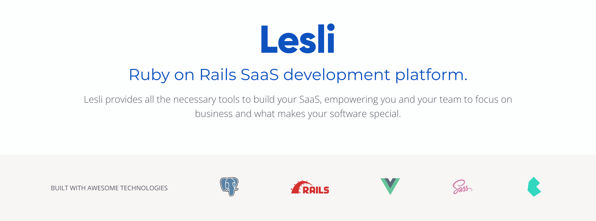

<p align="center">
    
    <h3 align="center">Ruby on Rails SaaS Development Framework.</h3>
</p>


<hr/>
    <p align="center">
        <a target="blank" href="https://rubygems.org/gems/lesli">
            
        </a>
        <a href="https://codecov.io/github/LesliTech/Lesli"> 
             
        </a>
    </p>
<hr/>


<br />



### Introduction 

Lesli is a SaaS development framework designed to build highly scalable, secure and customizable software products.

Built-on top of Ruby on Rails, Postgres, Vuejs, Bulma, SASS and many more awesome open-source libraries, packages, gems and tools.

Lesli is completely open source and comes with features and tools that can save you years of development effort, additionally, our pre-built modules can seamlessly extend Lesli's functionality, allowing you to build your own SaaS in a matter of minutes.

<br />
    <hr />
        <p align="center">
            Lesli is currently in alpha, but we're excited about the promising improvements coming soon!
        </p>
    <hr />
<br />


<br />

Lesli is officially released and supported as of version 5

> Lesli goes beyond being just a starter-kit, template, admin panel or dashboard. Lesli is a Ruby on Rails gem that you can use to build modules (a.k.a. engines) and standard Rails applications leveraging its robust set of built-in features, generators, components, and industry standards. With Lesli, you have the flexibility to extend existing functionalities or develop fully customized software tailored to your specific needs.


<br />

### Documentation
* [Roadmap](./docs/roadmap.md)
* [Core database](./docs/database.md)
* [Main documentation](https://www.lesli.dev/documentation/)


<br />

### Quick start

```shell
# Add Lesli engine
bundle add lesli
```

```shell
# Setup database
rake lesli:db:setup
```

```ruby
# Load Lesli
Rails.application.routes.draw do
    mount Lesli::Engine => "/lesli"
end
```


<br />

### Development 

```shell
# clone the lesli repo inside your engine folder: RailsApp/engines
git clone https://github.com/LesliTech/Lesli.git
```
```ruby
# Load Lesli as a Gem
gem "lesli", path: "engines/Lesli"
```
```shell
# Install the necessary Gems to run Lesli
bundle install
```
```shell
# Generate Lesli initializer
rails g lesli:install
```
```shell
# Hard reset Database for development:
rake lesli:db:reset 
```
```shell
# Run default Rails server
rails s 
rails s --binding=0.0.0.0
rails s --environment=test
rails s --environment=development
RAILS_SERVE_STATIC_FILES=true rails s --environment=production 
```


<br />

### Get in touch

* [Website: https://www.lesli.tech](https://www.lesli.tech)
* [Email: hello@lesli.tech](hello@lesli.tech)
* [Twitter: @LesliTech](https://twitter.com/LesliTech)


<br />

### License
-------
Copyright (c) 2023, Lesli Technologies, S. A.

This program is free software: you can redistribute it and/or modify
it under the terms of the GNU General Public License as published by
the Free Software Foundation, either version 3 of the License, or
(at your option) any later version.

This program is distributed in the hope that it will be useful,
but WITHOUT ANY WARRANTY; without even the implied warranty of
MERCHANTABILITY or FITNESS FOR A PARTICULAR PURPOSE. See the
GNU General Public License for more details.

You should have received a copy of the GNU General Public License
along with this program. If not, see http://www.gnu.org/licenses/.

<hr />
