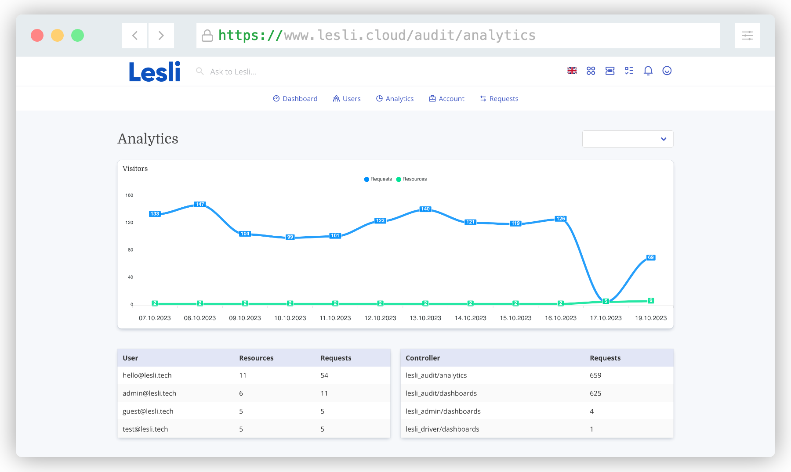

<div align="center">
    
    <h1 align="center">Lesli</h1>
    <h3 align="center">The Open-Source SaaS Development Framework for Ruby on Rails.</h3>
</div>

<br />

<div align="center">
    <a target="_blank" href="https://github.com/LesliTech/Lesli/actions/workflows/lesli-ci-tests.yaml">
        
    </a>
    <a target="_blank" href="https://rubygems.org/gems/lesli">
        
    </a>
    <a target="_blank" href="https://codecov.io/github/LesliTech/Lesli">
        
    </a>
    <a target="_blank" href="https://sonarcloud.io/project/overview?id=LesliTech_Lesli">
        
    </a>
</div>

<br />

<div align="center">
    
</div>

---

## Introduction

Lesli is an open-source framework built to create scalable, secure, and modular software products.

Built on **Ruby on Rails, Hotwire, and Tailwind CSS**, with support for **SQLite and PostgreSQL**, Lesli provides the infrastructure, architecture, and reusable components needed to build production-ready SaaS platforms faster.

Lesli is not a starter kit, admin panel, or boilerplate. It is a **modular foundation** that allows you to build applications using independent engines, shared infrastructure, and proven SaaS patterns.

With Lesli, you focus on features—not infrastructure.

## Why Lesli?

Lesli core and its official engines provide:

- Modular architecture powered by standard Rails engines
- Flexible authentication, detailed privileges, and access control
- System auditing with activities and version tracking
- Attachments that can be added to any resource
- Full-text search across modules and records
- Multi-language support for both core and custom modules
- An architecture designed for long-term SaaS scalability and maintainability

## Try Lesli

- [Try the online demo](https://demo.lesli.dev/)
- [Run the Docker demo](https://github.com/LesliTech/lesli-docker-demo)

## Quick Start

### Requirements

- Ruby 3.2 or newer
- Rails 8.1
- SQLite, included in the default Rails application

Optional tooling:

- PostgreSQL for applications that prefer it over SQLite
- Node.js 20.x for advanced frontend development tasks

The default Lesli application can be built and run using only Rails and the Lesli gems.

### Create the application

Create a Rails application using Rails' default SQLite database:

```shell
rails new LesliApp
cd LesliApp
```

### Install Lesli

Add the gem and run the installation generator:

```shell
bundle add lesli
bin/rails generate lesli:install
```

### Prepare the database

Prepare the development database and verify the installation:

```shell
bin/rails lesli:db:prepare
bin/rails lesli:status
```

> [!WARNING]
> `bin/rails lesli:db:rebuild` drops, recreates, migrates, and seeds the database. Use it only when you intentionally want to replace the current development data.

### Start the server

```shell
bin/rails server
```

Then visit [http://127.0.0.1:3000/login](http://127.0.0.1:3000/login).

## Development

### Development template

To generate a complete demo application from the current development source:

```shell
rails new LesliDemo \
  --skip-bundle \
  -m https://raw.githubusercontent.com/LesliTech/Lesli/master/templates/template-dev.rb
```

> [!NOTE]
> The development template clones the mutable `master` branch of every Lesli repository. Use released gems for production applications.

### Manual local setup

To work on Lesli from a host Rails application, clone it into the application's `engines` directory:

```shell
cd RailsApp
mkdir -p engines
git clone https://github.com/LesliTech/Lesli.git engines/Lesli
```

Reference the local engine from the host application's `Gemfile`:

```ruby
gem "lesli", path: "engines/Lesli"
```

Install and initialize the local engine:

```shell
bundle install
bin/rails generate lesli:install
bin/rails lesli:db:prepare
bin/rails server
```

For additional server configurations, use the standard Rails server options:

```shell
bin/rails server --binding=0.0.0.0
bin/rails server --environment=development
```

## Documentation

- [Lesli website](https://www.lesli.dev/)
- [Documentation](https://www.lesli.dev/lesli/)
- [Contribution guide](./docs/contributing/github.md)
- [Releases and changelog](https://github.com/LesliTech/Lesli/releases)

## Community

- [X: @LesliTech](https://x.com/LesliTech)
- [hello@lesli.tech](mailto:hello@lesli.tech)
- [https://www.lesli.tech](https://www.lesli.tech)

## License

Copyright (c) 2026, Lesli Technologies, S. A.

This program is free software: you can redistribute it and/or modify
it under the terms of the GNU General Public License as published by
the Free Software Foundation, either version 3 of the License, or
(at your option) any later version.

This program is distributed in the hope that it will be useful,
but WITHOUT ANY WARRANTY; without even the implied warranty of
MERCHANTABILITY or FITNESS FOR A PARTICULAR PURPOSE. See the
GNU General Public License for more details.

You should have received a copy of the GNU General Public License
along with this program. If not, see [https://www.gnu.org/licenses/](https://www.gnu.org/licenses/).

The complete license text is available in the [license file](./license).

---

<div align="center">
    
    <h3 align="center">The Open-Source SaaS Development Framework for Ruby on Rails.</h3>
</div>
